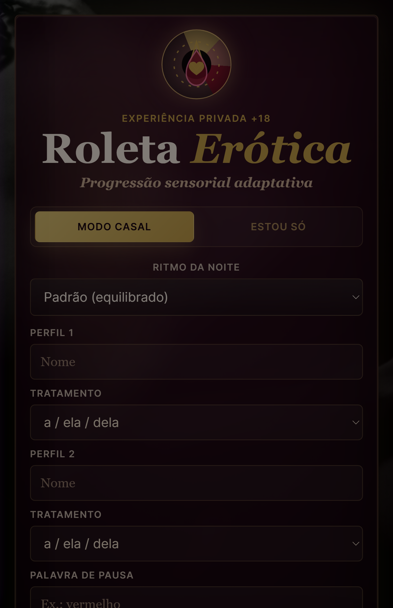
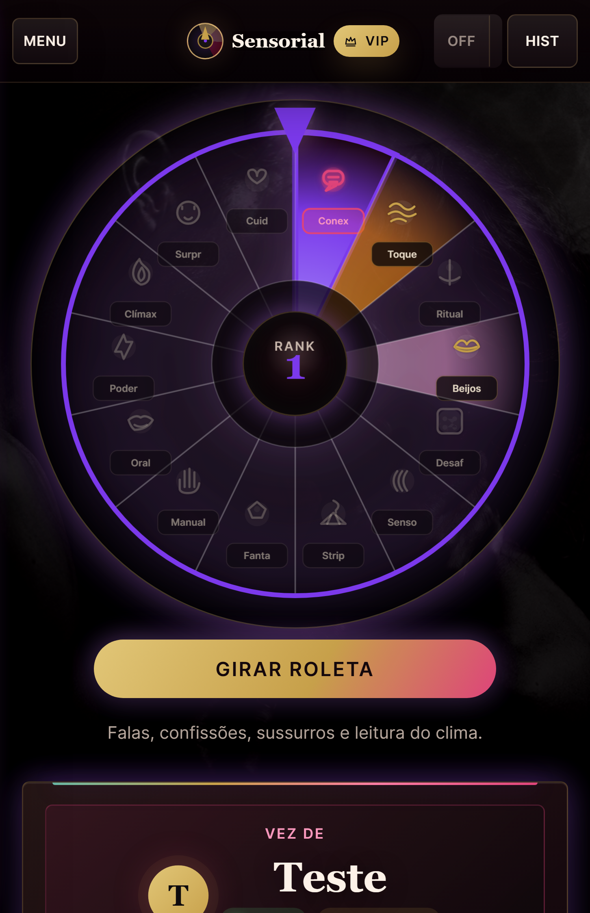
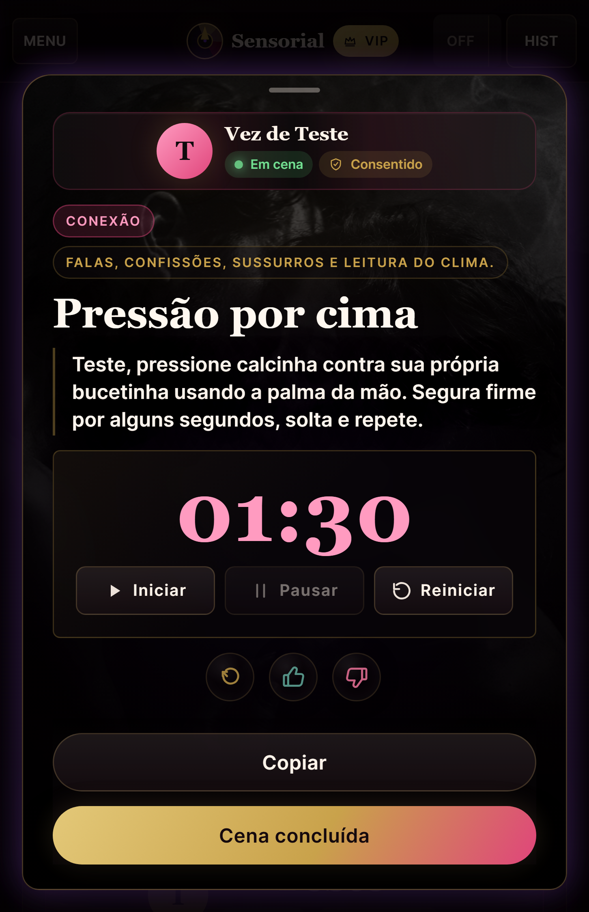

# 🎡 Roleta Erótica: Progressão Sensorial

> PWA privada e progressiva para adultos — uma roleta sensorial adaptativa com histórico local, filtros de limites e funcionamento offline.

---

## ⚠️ Aviso

**Conteúdo exclusivo para maiores de 18 anos.**  
Use apenas em contexto consensual, privado e com respeito aos limites de todas as pessoas envolvidas.

---

## 📱 Capturas de Tela

  
  
  

---

## ✨ Funcionalidades

- 🎲 **14 seções temáticas** — de Conexão a Aftercare, cada giro revela uma nova experiência sensorial
- 👥 **Modos casal e solo**, com variações para diferentes configurações de gênero (FF, MM, HM)
- 🧠 **Sistema adaptativo** que alterna turnos, aprende preferências e ajusta o tom automaticamente
- 🔁 **Loops de recuo** — a roleta recua estrategicamente para prolongar a experiência antes do clímax
- 🔞 **Filtro de limites** — anal, garganta, impacto, gravação e mais, configuráveis por perfil
- 📝 **Histórico completo** com feedback (curti/não curti) e arquivo de noites anteriores
- 🌐 **PWA instalável** — funciona offline, sem backend, sem rastreamento
- 🎨 **Tema Boudoir** — visual escuro elegante com gradientes, blur e tipografia serifada
- 🎵 **Trilha sonora** com controle de volume e mute
- ⏱️ **Timer e vibração** — timer regressivo com haptic feedback e alertas sonoros
- 🌡️ **Termômetro de excitação** — controle individual do nível de cada participante
- 👔 **Gestão de vestimenta** — a roleta sabe se vocês já estão nus ou ainda de roupa

---

## 🎯 As 14 Seções

| Rank | Seção | Cor | Exemplo de desafio |
|:---:|:---|:---|:---|
| 1 | 👁️ Conexão | `#7c3aed` | Confissões, sussurros, mapas do desejo |
| 2 | 💆 Toque & Massagem | `#d97706` | Ponta dos dedos, massagem guiada |
| 3 | 🌅 Rituais & Rotina | `#f59e0b` | Respiração sincronizada, banho de mãos |
| 4 | 🫦 Beijos | `#f9a8d4` | Beijo cronometrado, mordida leve |
| 5 | 🎲 Desafios & Brincadeiras | `#f97316` | Imitar gemido, karaokê brega, verdade ou desafio |
| 6 | 🌬️ Sensorial | `#38bdf8` | Gelo na nuca, venda com texturas |
| 7 | 🎀 Strip & Exibição | `#f2c36b` | Striptease guiado, espelho, voyeurismo |
| 8 | 🧠 Fantasia & Roleplay | `#a855f7` | Estranhos no bar, professor e aluna |
| 9 | 🖐️ Manual | `#fb923c` | Mão guiada, edging, brinquedos |
| 10 | 👄 Oral | `#ff4778` | Figura 8, alfabeto, 69, facesit |
| 11 | 🎭 Poder & Provocação | `#9f1239` | Tapas, restrições, orgasmo sob comando |
| 12 | 🔥 Clímax | `#dc2626` | Posições, penetração, orgasmo sincronizado |
| 13 | 🎪 Surpresa | `#8b5cf6` | Coringas, adoração de pés, plugs |
| 14 | 🧖 Aftercare | `#10b981` | Abraço, água, check-in emocional, conchinha |

---

## 📦 Estrutura do projeto

``txt
roleta-sensorial/
├── index.html
├── style.css
├── theme-boudoir.css
├── app.js
├── manifest.json
├── service-worker.js
├── assets/
│   ├── icons/
│   │   ├── icon-192.png
│   │   └── icon-512.png
│   ├── images/
│   │   ├── fundo-01.jpg
│   │   └── fundo-02.jpg
│   └── audio/
│       └── background.mp3
├── docs/
│   ├── screenshot-entry.png
│   ├── screenshot-wheel.png
│   └── screenshot-result.png
└── README.md

---

### 🗂️ Descrição dos diretórios

| Pasta/Arquivo | Conteúdo |
|---|---|
| `index.html` | Interface completa: formulário de entrada, roleta canvas, modais |
| `app.js` | Motor do jogo (~3500 linhas): heurística, pesos, sessão, áudio, vibração |
| `style.css` | Design system com tokens, reset, layout responsivo |
| `theme-boudoir.css` | Tema visual escuro com gradientes e tipografia serifada |
| `style-mobile-compact.css` | Ajustes finos para iPhone SE e telas ≤430px |
| `manifest.json` | Metadados PWA: nome, ícones, cores, orientação |
| `service-worker.js` | Cache offline com estratégia Network First + Cache First |
| `data/challenges.js` | Banco com +300 comandos organizados em 14 seções |
| `assets/icons/` | 12 ícones PNG + SVG (16px a 512px, maskable) |
| `assets/audio/` | Trilha sonora de fundo (background.mp3) |
| `assets/fundo-*.jpg` | Imagens de fundo temáticas para cada fase |
| `tools/optimize-assets.py` | Script Python para compressão de imagens |

  

---
